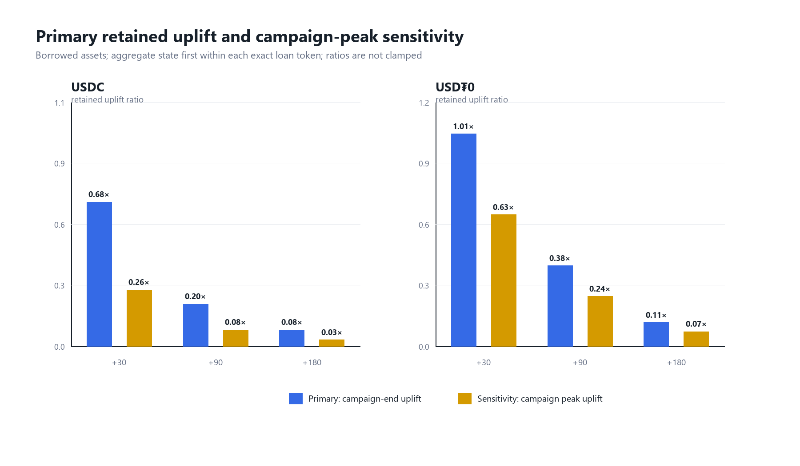
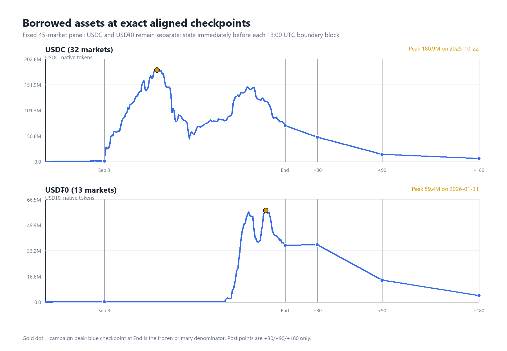
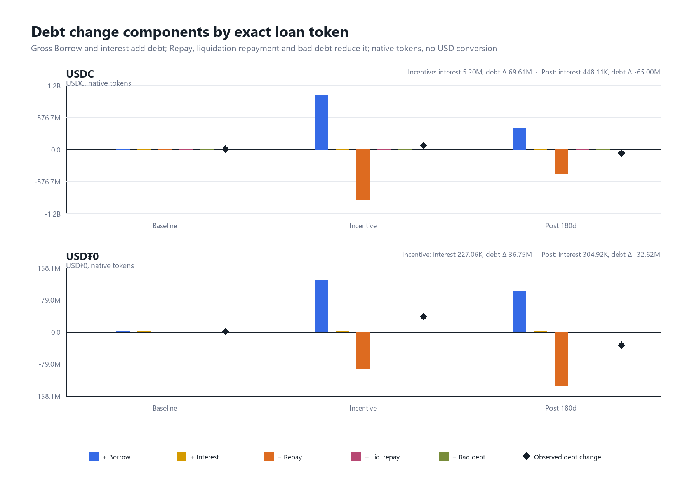
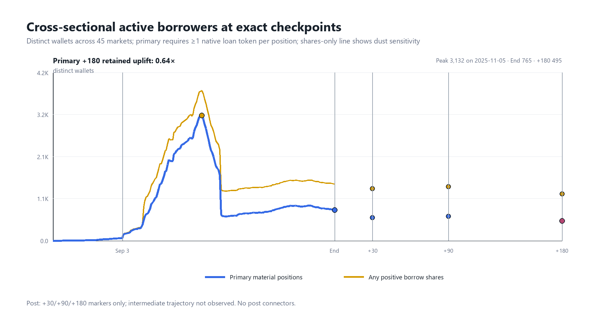
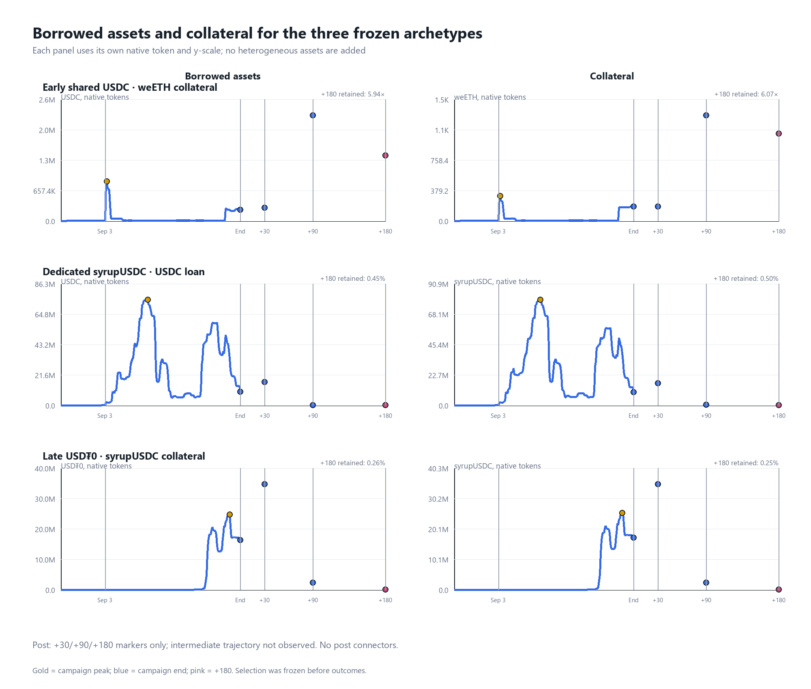
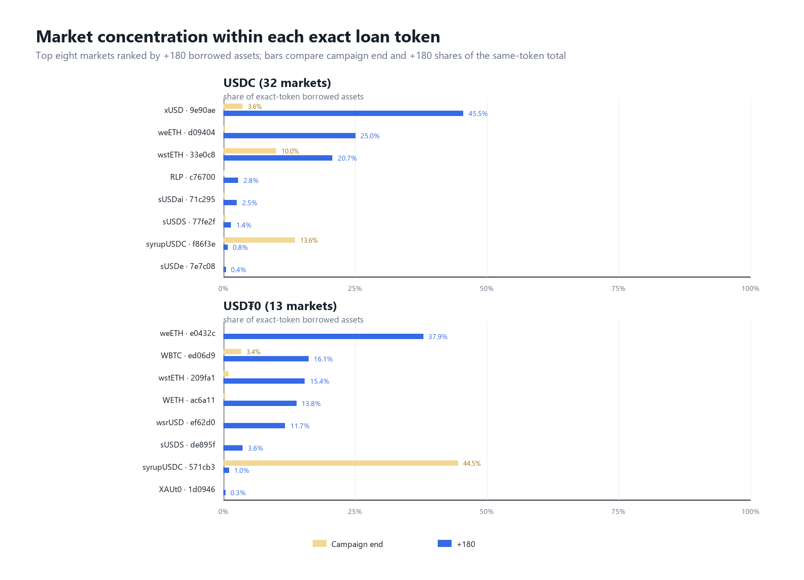

# Did DRIP Create Sticky Lending Demand?

## Executive Summary

**Morpho on Arbitrum, 180 days later:** outstanding borrowing remained above baseline, but most campaign-end uplift had unwound. At +180, the primary retained-uplift ratio was **7.7% for USDC** and **11.3% for USD₮0**. The study measures observed persistence; it cannot establish that DRIP caused it.

**Balances and uplift are different.** The full outstanding balances at +180 were **5.65M USDC** and **4.14M USD₮0**. These are not amounts of debt created or preserved by DRIP. The ratios above subtract the pre-campaign baseline from both the post balance and the campaign-end balance.

**Participation was more persistent than balance size.** Material active-borrower uplift retained 63.8%, while market outcomes varied sharply. A future program should test narrower market selection and staged incentives, not repeat the broad design unchanged.

This is a reviewed local release candidate awaiting publication approval, not a publication. Independent re-review returned **APPROVE WITH CAVEATS**; R1–R4 are **CLOSED**. [Re-review and evidence](reviews/public/README.md) · [Review response](docs/RESPONSE_TO_REVIEW.md) · [Decision memo](reports/DRIP_LENDING_DEMAND_REPORT.md) · [Provenance](docs/HEADLINE_PROVENANCE.md) · [Reproduction](docs/REPRODUCTION.md) · [Limitations](docs/RELEASE_LIMITATIONS.md)

**Reproduction boundary:** the CSV-only route is autonomous with the documented runtime/fonts. The tested SQLite-route requires an external accepted database and metadata snapshot; public acquisition of that bundle is unavailable. Full raw rebuild was not run, and browser/GitHub rendering was not checked. This is **not a self-contained raw-reconstruction package**.

## What is being measured?

The panel is fixed at **45 ever-eligible Morpho markets**: 32 with USDC loans and 13 with USD₮0 loans. Balances are aggregated only within the same exact token address; neither loan assets nor heterogeneous collateral assets are mixed into a USD total.

- `B`: mean of 56 campaign-hour-aligned baseline closes, before September 3, 2025 at 13:00 UTC.
- `E`: state immediately before February 18, 2026 at 13:00 UTC, the campaign end.
- `P30`, `P90`, `P180`: exact checkpoints on March 20, May 19, and August 17, 2026 at 13:00 UTC.
- Primary retained uplift: **`(P_k − B) / (E − B)`**, only when `E > B`. Otherwise the ratio is `not_applicable`; levels and deltas remain visible.
- Campaign peak is a separately labeled sensitivity, not a replacement denominator.

The [frozen v1.0 definitions](docs/METRICS.md) govern all calculations. The production grain is `market_id × UTC day`; exact 13:00 states use the accepted block-boundary map and ordered events, not midnight proxies.

## Most campaign-end debt uplift had unwound by +180

USDC primary retained uplift fell from 67.9% at +30 to 19.8% at +90 and 7.7% at +180. USD₮0 moved from 101.0% to 38.3% and 11.3%. A ratio above 100% means further growth above campaign end, not a causal claim. For market-level borrowed assets, 42 markets are applicable and three are not; all 45 remain in the panel.



Campaign peaks were much higher than campaign end. At +180, peak-relative uplift was only 3.0% for USDC and 7.0% for USD₮0. Connecting lines between the three post checkpoints are visual guides, not observed daily post-period trajectories. [Reviewed portfolio CSV](data/morpho_phase7_portfolio_retained_uplift.csv)



## Debt growth includes interest, not only new borrowing

During the incentive interval, accrued interest contributed 5.20M USDC and 0.23M USD₮0 to outstanding debt. Over the full post interval, borrowing still occurred, but repayment and liquidation outflows were larger. The exact debt equation reconciles borrow, repay, interest, liquidation repayment and bad debt with zero residual. Gross loan flows may include refinancing or repeated leverage; they are not unique end-user demand. [Reviewed flow CSV](data/morpho_phase7_period_flows.csv)



## Remaining wallets did not imply remaining balance size

A material active borrower has positive borrow shares and at least one native loan token of debt after Morpho's round-up conversion. The distinct-wallet count across the fixed panel fell from 765 at campaign end to 495 at +180, versus a baseline mean of 19.3: **63.8% retained uplift**. This is a cross-sectional count, not the retention of a cohort of the same wallets. The shares-only dust sensitivity is higher and is not the primary measure.



In the revised release figure, post values are isolated +30/+90/+180 markers. Intermediate trajectory is not observed; the dense line ends at campaign end.

## Market selection matters

Three archetypes were selected before outcomes. The early shared USDC/weETH market expanded after campaign end, retaining 5.94× its end uplift. The dedicated syrupUSDC/USDC and late USD₮0/syrupUSDC examples retained only 0.45% and 0.26% of borrowed-asset uplift. Collateral follows its own native token in each panel; panel scales differ deliberately. These examples explain heterogeneity, not causal treatment effects. [All market metrics](data/morpho_phase7_market_retained_uplift.csv)



The revised archetype figure likewise has three post markers, not a daily post path. Each panel retains its own native unit and scale.

USDC's top-three share of outstanding debt rose from 65.8% at campaign end to 91.2% at +180. Concentration is measured across markets within one loan-token group, never across wallets or people. Shared campaign pools and direct-vault incentives are not allocated to these markets. [Concentration CSV](data/morpho_phase7_market_concentration.csv)



## What should the next program do?

Pilot a narrower set of markets with precommitted +30/+90 balance and material-borrower targets, a staged taper, and a holdback conditional on the intended persistence measure. Monitor balances and meaningful participation together; high wallet counts can coexist with very small loan balances. Do not infer a precise subsidy allocation or cost per retained dollar from this study.

The next causal question needs exact recipient exposure, other-incentive/rate context, and a defensible comparison group. Maturities, migrations, collateral prices, organic adoption and broader lending conditions remain alternative explanations.

## Evidence and reproducibility

Accepted source coverage is 1,231,462 unique scoped logs in 3,157 immutable shards. The production layer has 18,225 unique market-day rows. Phase 7 reconciles 10,215 wallet-share/market checkpoints, preserves exact accounting and separates interest from flows. A separate-code release preflight recomputed all 648 market/portfolio metric rows with zero differences; isolated reproduction matched five CSVs and six figures byte-for-byte. This same-author check does not replace independent review.

Technical/descriptive confidence is high; decision usefulness is moderate; causal confidence is low. Wallets are not people or proven reward recipients. There is no price layer, wallet cohort analysis, or wallet concentration analysis. Non-zero fee shares remain empirically unexercised; three non-zero bad-debt events were covered. [Full limitations](docs/RELEASE_LIMITATIONS.md) · [Release preflight](docs/RELEASE_CANDIDATE_QA.md)

```text
README.md                         answer-first case and figures
reports/DRIP_LENDING_DEMAND_REPORT.md  concise decision memo
docs/METRICS.md                   immutable v1.0 definitions
docs/HEADLINE_PROVENANCE.md       number-to-code/evidence map
docs/REPRODUCTION.md              runtimes, snapshots, run order
docs/REVIEWER_BRIEF.md             independent recomputation brief
sql/                             executable SQLite replay and QA
scripts/                         Python runners and offline checks
data/                            reviewed CSV/JSON evidence
figures/                         six reproducible PNGs
```

Raw shards, SQLite databases and caches are intentionally excluded from a Git release. Full reproduction requires the checksum-matched source bundle described in the reproduction guide; no download location is claimed yet. Release hygiene and source-access approval remain gates before any publication. This independent pseudonymous project is not affiliated with Arbitrum, DRIP or Morpho.
